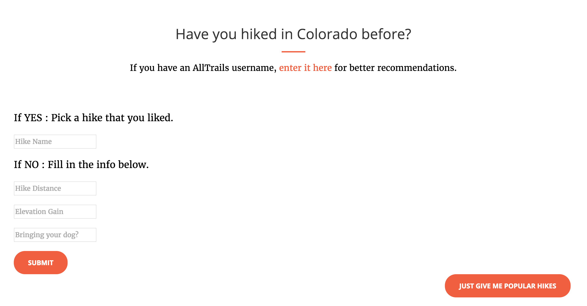
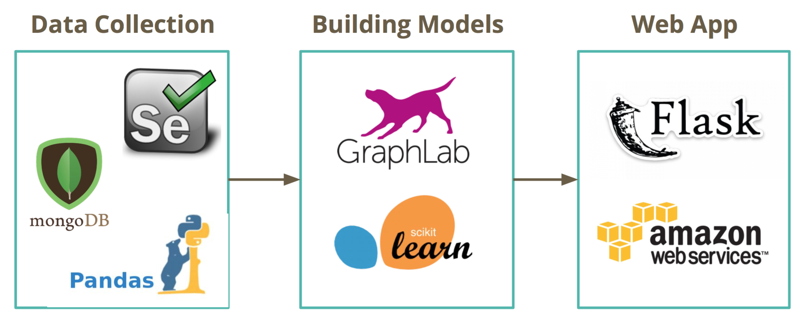
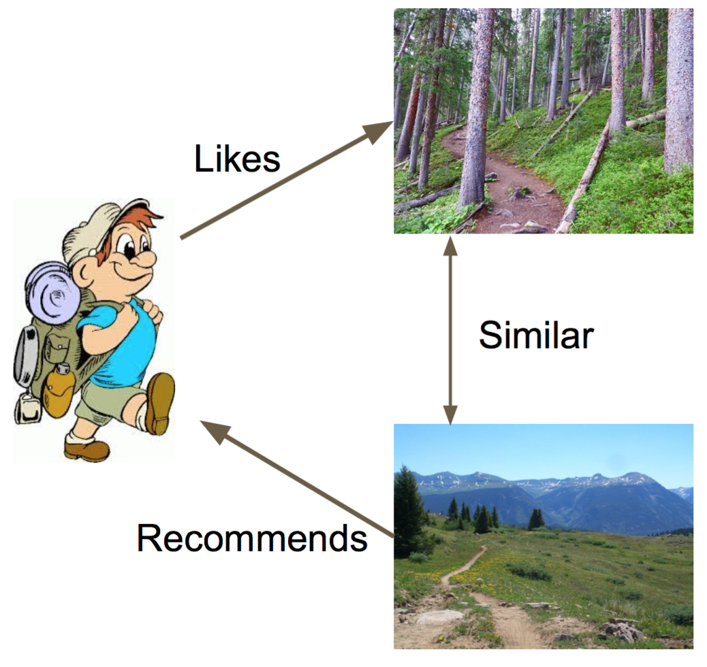
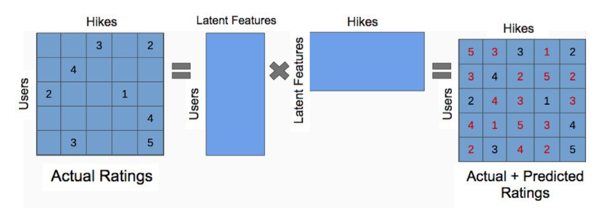

# Take A Hike - A Colorado Trail Recommender

Olivia Schow

Galvanize Data Science Immersive - Capstone Project - November 2016

## Overview

I hike a lot. My closest friends and family are avid hikers and I always get dragged along. However, I'll be the first to say that I don't enjoy it. That doesn't mean that every hike is terrible; I have been on some great ones. Afterwords, I've always thought to myself, why can't all hikes be like that one? Well, Take A Hike is here to solve that problem!! It will recommend hikes to you based one trails you know you like.

## Web Application:  [TakeAHikeColorado.com](http://takeahikecolorado.com/)


At TakeAHikeColorado.com you can input a hike that you know you like, and it will recommend similar hikes. If you have a AllTrails username, you can provide that for tailored hike recommendations. Or if you're new to hiking in Colorado, you can simply input some information about what type of hike you want (hike distance, elevation gain, and whether or not you want to bring your dog) and it will give you the most popular hikes that match those specifications.



[TakeAHikeColorado.com](http://takeahikecolorado.com/) is created using Flask and self-hosted on AWS.

## The Process



## Data Collection and Cleaning

I got all of my data from AllTrails.com. Using Selenium, I web scraped their list of the best hikes in Colorado. I also web scraped all of the hike meta data, including all of the users who reviewed the hike and the corresponding ratings. Once I cleaned the data by getting rid of the hikes that had no ratings or were missing data, I was left with about 1500 trails. I also turned some of the hike attributes into features.

The features for each hike were: Hike ID, Hike Name, Hike Region, Total Distance, Elevation Gain, Hike Difficulty, Stars, Route Type (Loop, Out and Back, Point to Point), Dog Friendly, Kid Friendly, Camping, Waterfall, River, Lake, Wild Flowers, Wildlife, Views.

## Recommendation Systems

Netflix, Amazon, Pandora, The Wall Street Journal. Sound familiar? We all encounter recommendation systems on a daily basis. These systems usually produce a list of recommendations in one of two ways. There is Content-Based Filtering and Collaborative Filtering. Content-Based Filtering approaches utilize a series of discrete characteristics of an item in order to recommend additional items with similar properties. Collaborative Filtering approaches building a model from a user's past behavior as well as similar decisions made by other users. This model is then used to predict items (or ratings for items) that the user may have an interest in.

#### Item Content Recommender

This recommender only takes into account information about the hikes. It looks at each pair of hikes and calculates how similar they are. This similarity score is calculated by first computing the similarity between each feature, then taking a weighted average of those to get the final similarity. So why is this useful for this project? Because you can start with a hike you know you like, and it can give you back the ones that are most similar to it.



#### Ranking Factorization Recommender

Given that each user has rated some hikes in the system, I wanted to predict how the users would rate the hikes that they have not yet rated. The intuition behind this recommender is that there should be some latent features that determine how a user rates an item. So why is it useful for this project? If we know the past behavior of a user, then we can now recommend hikes that they should rate highly.



#### Popularity Recommender

This recommender does exactly what it says it does. It recommends the most popular items. So why is it useful for this project? It is a solution for the cold start problem (if a user hasn't hiked in Colorado before).

## Repo Structure

```
├── AllTrails
|     ├── Code
|     |     ├── compare_recommenders.py (Compares RMSE of all recommenders)
|     |     ├── cosine_similarity.py (Implements my own cosine similarity function)
|     |     ├── ranking_factorization_model.py (Tests the Ranking Factorization Recommender)
|     |     └── save_rec_models.py (Saves all recommenders used in web app)
|     ├── Data
|     |
|     ├── Scrape_Clean
|     |     ├── clean_data.py (Cleans data)
|     |     ├── mongo_to_pandas.py (Moves data from MongoDB to Pandas)
|     |     └── scrape_ratings.py (Scrapes AllTrails)
|     └── Web App
|           ├── hike_content_recommender
|           ├── hike_popularity_recommender
|           ├── rank_factorization_recommender
|           ├── static
|           ├── templates
|           └── app.py (runs web app)
|
├── ProTrails
|
└── README.md
```
